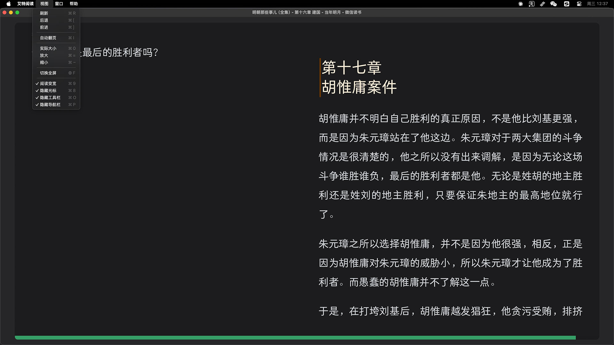

<div align="center">


### 🚀 基于 Tauri v2 + Rust 的高性能微信读书桌面客户端

<p>
  <a href="https://github.com/dengcb/weixin-reader-desktop/releases"></a>
  <a href="LICENSE"></a>
  
  
  
</p>

<p>
  <a href="#-选择理由">选择理由</a> •
  <a href="#-核心特性">核心特性</a> •
  <a href="#-快速开始">快速开始</a> •
  <a href="#-开发指南">开发指南</a> •
  <a href="#-技术架构">技术架构</a>
</p>



</div>

---

## 💡 选择理由

> 通过脚本注入方式增强官方 Web 端体验，完全兼容官方功能的同时提供更好的桌面体验

<table>
<colgroup>
<col style="width: 33%">
<col style="width: 33%">
<col style="width: 33%">
</colgroup>
<tr>
<td align="center">

### 📦 极致轻量

**安装包仅 ~5MB**<br>
内存占用低至 **100MB**<br>
相比 Electron 降低 **80%**
&emsp;&emsp;&emsp;&emsp;&emsp;&emsp;&emsp;&emsp;&emsp;&emsp;&emsp;&emsp;&emsp;&emsp;&emsp;

</td>
<td align="center">

### ⚡ 原生性能

基于 **Rust + Tauri v2** 构建<br>
启动速度快<br>
CPU 占用低
&emsp;&emsp;&emsp;&emsp;&emsp;&emsp;&emsp;&emsp;&emsp;&emsp;&emsp;&emsp;&emsp;&emsp;&emsp;

</td>
<td align="center">

### 🔒 安全可靠

完全开源<br>
无广告/无跟踪<br>
数据直连官方
&emsp;&emsp;&emsp;&emsp;&emsp;&emsp;&emsp;&emsp;&emsp;&emsp;&emsp;&emsp;&emsp;&emsp;&emsp;

</td>
</tr>
</table>

---

## ✨ 核心特性

### 🖥️ 桌面体验

```
✓ macOS 原生菜单栏            ✓ 窗口位置/大小记忆
✓ 完整键盘快捷键               ✓ 恢复最后阅读页面
✓ 多显示器支持                 ✓ 一键移动窗口
```

### 📖 阅读增强

<table>
<colgroup>
<col style="width: 50%">
<col style="width: 50%">
</colgroup>
<tr>
<td>

**🎨 界面优化**
- 🌓 深色模式 - 护眼舒适
- 📺 宽屏模式 - 沉浸阅读
- 🧹 隐藏边栏 - 纯净界面
- 🔍 缩放控制 - 自由调节
&emsp;&emsp;&emsp;&emsp;&emsp;&emsp;&emsp;&emsp;&emsp;&emsp;

</td>
<td>

**⌨️ 翻页控制**
- 🖱️ 触摸板双指滑动
- ⚡ 自动翻页（可调速）
- 👻 鼠标自动隐藏
- 🎯 精准进度显示
&emsp;&emsp;&emsp;&emsp;&emsp;&emsp;&emsp;&emsp;&emsp;&emsp;

</td>
</tr>
</table>

### 🔌 插件化架构 <sup>v0.8.0 历史性更新</sup>

> 全新可插拔式插件系统，支持第三方适配器与自定义脚本

```
✓ 支持 .atrd 插件包安装/卸载     ✓ 微信读书作为内置默认插件
✓ 标准化插件开发接口             ✓ 预留本地阅读(EPUB/TXT)能力
✓ 插件级命名空间隔离             ✓ 独立配置与存储系统
```

### 🛠️ 可视化插件编辑器 <sup>v0.9.0 新增</sup>

> 内置插件开发工具，无需外部 IDE 即可创建和编辑插件

<table>
<colgroup>
<col style="width: 50%">
<col style="width: 50%">
</colgroup>
<tr>
<td>

**📝 表单式配置**
- 基本信息（ID、名称、版本、描述）
- 站点配置（域名、URL 模式）
- 功能能力（宽屏、深色、翻页等）
&emsp;&emsp;&emsp;&emsp;&emsp;&emsp;&emsp;&emsp;&emsp;&emsp;

</td>
<td>

**💻 代码编辑**
- TypeScript 语法高亮
- 多文件标签页切换
- 实时预览插件信息
&emsp;&emsp;&emsp;&emsp;&emsp;&emsp;&emsp;&emsp;&emsp;&emsp;

</td>
</tr>
</table>

```
路径: 设置 → 插件管理 → 新建插件
```

### 🏪 多站点书店切换 <sup>v1.0.0 新增</sup>

> 以插件为数据源的多站点阅读器，一个壳切换多个书城

```
✓ 外部插件运行时加载               ✓「书店」菜单站内切换 + 当前站对勾
✓ 每个书店独立记住阅读进度          ✓ 卸载重装进度自动接回
✓ macOS 拦第三方追踪域名           ✓ 番茄小说作为官方插件开发范例
```

### 🔄 智能更新

- ✅ 启动后自动检测更新
- 📥 一键下载安装
- 🔔 新版本通知

---

## 🚀 快速开始

### 📥 下载安装

前往 [**Releases 页面**](https://github.com/dengcb/weixin-reader-desktop/releases/latest) 下载最新版本：

<table>
<tr>
<th width="40%">芯片类型</th>
<th width="60%">下载文件</th>
</tr>
<tr>
<td>🍎 Apple Silicon (M1/M2/M3/M4)</td>
<td><code>weixin-reader_x.x.x_aarch64.dmg</code></td>
</tr>
<tr>
<td>💻 Intel</td>
<td><code>weixin-reader_x.x.x_x64.dmg</code></td>
</tr>
</table>

### 🔨 从源码构建

```bash
# 1. 克隆仓库
git clone https://github.com/dengcb/weixin-reader-desktop.git
cd weixin-reader-desktop

# 2. 安装依赖
bun install

# 3. 构建发布版本
bun release:arm    # Apple Silicon
bun release:intel  # Intel
```

### 🪟 Windows 构建（在 macOS 上交叉编译）

```bash
# 1. 首次安装（仅需一次）
brew install llvm
cargo install cargo-xwin
rustup target add x86_64-pc-windows-msvc

# 2. 构建
export PATH="/opt/homebrew/opt/llvm/bin:$PATH"
bun run build
cargo xwin build --release --target x86_64-pc-windows-msvc --manifest-path src-tauri/Cargo.toml

# 产物: src-tauri/target/x86_64-pc-windows-msvc/release/weixin-reader.exe (~7MB)
```

---

## 🛠️ 开发指南

### 📋 环境准备

<table>
<tr>
<td width="50%">

**安装 Rust**
```bash
curl --proto '=https' --tlsv1.2 -sSf \
  https://sh.rustup.rs | sh
```

</td>
<td width="50%">

**安装 Bun**
```bash
curl -fsSL https://bun.sh/install | bash
```

</td>
</tr>
</table>

### ⚡ 开发命令

```bash
# 安装依赖
bun install

# 🚀 启动开发模式（热重载 + 自动同步版本）
bun start

# 🔨 构建注入脚本
bun run build:inject

# 📦 完整构建
bun run build
```

### 🐛 调试构建

```bash
bun run debug        # 快速调试（ARM）
bun run debug:arm    # Apple Silicon
bun run debug:intel  # Intel
```

### 📤 发布打包

```bash
bun release:all    # 构建所有架构
bun release:arm    # Apple Silicon
bun release:intel  # Intel
bun release:clear  # 清理发布文件
```

### ✅ 测试

<table>
<tr>
<td width="50%">

**Rust 后端测试**
```bash
cd src-tauri && cargo test
```

</td>
<td width="50%">

**TypeScript 前端测试**
```bash
bun test
```

</td>
</tr>
</table>

---

## 🏗️ 技术架构

### 📚 技术栈

<table>
<colgroup>
<col style="width: 15%">
<col style="width: 25%">
<col style="width: 60%">
</colgroup>
<tr>
<th>层级</th>
<th>技术</th>
<th>说明</th>
</tr>
<tr>
<td><b>前端</b></td>
<td>TypeScript + Vite</td>
<td>注入脚本开发与构建&emsp;&emsp;&emsp;&emsp;&emsp;&emsp;&emsp;&emsp;</td>
</tr>
<tr>
<td><b>后端</b></td>
<td>Rust + Tauri v2</td>
<td>原生桌面能力与系统集成&emsp;&emsp;&emsp;&emsp;&emsp;&emsp;&emsp;&emsp;</td>
</tr>
<tr>
<td><b>构建</b></td>
<td>Bun</td>
<td>极速包管理与脚本执行&emsp;&emsp;&emsp;&emsp;&emsp;&emsp;&emsp;&emsp;</td>
</tr>
<tr>
<td><b>测试</b></td>
<td>Cargo + Bun Test</td>
<td>双层测试覆盖（332+ 测试用例）&emsp;&emsp;&emsp;&emsp;&emsp;&emsp;&emsp;&emsp;</td>
</tr>
</table>

### 🎯 核心架构：脚本注入模式

```
┌──────────────────────────────────────────────────────────┐
│                      Tauri 应用                           │
├──────────────────────────────────────────────────────────┤
│                                                          │
│  ┌─────────────┐        IPC         ┌─────────────────┐  │
│  │             │◄──────────────────►│                 │  │
│  │  Rust 后端   │                    │  WebView 前端   │  │
│  │             │                    │                 │  │
│  │  • 原生菜单  │                    │  • inject.js    │  │
│  │  • 设置持久  │                    │  • 六大管理器     │  │
│  │  • 多显示器  │                    │  • 状态同步      │  │
│  │  • 自动更新  │                    │                 │  │
│  │             │                    │                 │ │
│  └─────────────┘                    └────────┬────────┘ │
│                                              │          │
└──────────────────────────────────────────────│──────────┘
                                               │
                              ┌────────────────▼──────────────┐
                              │   weread.qq.com (官方网站)     │
                              └───────────────────────────────┘
```

### 🧩 前端模块（六大管理器）

位于 `src/scripts/managers/` 目录：

<table>
<tr>
<th width="25%">管理器</th>
<th>核心职责</th>
</tr>
<tr>
<td><code>IPCManager</code></td>
<td>🎯 中央事件总线，路由/标题监控</td>
</tr>
<tr>
<td><code>AppManager</code></td>
<td>🚀 应用初始化，恢复阅读进度</td>
</tr>
<tr>
<td><code>MenuManager</code></td>
<td>📋 菜单状态同步，处理菜单动作</td>
</tr>
<tr>
<td><code>StyleManager</code></td>
<td>🎨 宽屏模式，隐藏工具栏，样式注入</td>
</tr>
<tr>
<td><code>ThemeManager</code></td>
<td>🌓 深色模式，链接处理，缩放控制</td>
</tr>
<tr>
<td><code>TurnerManager</code></td>
<td>📖 翻页控制器（含子模块：自动翻页、滑动翻页、鼠标隐藏）</td>
</tr>
</table>

### 🦀 Rust 后端

位于 `src-tauri/src/` 目录：

<table>
<tr>
<th width="25%">模块</th>
<th>核心职责</th>
</tr>
<tr>
<td><code>lib.rs</code></td>
<td>🎯 应用入口，插件初始化，脚本注入</td>
</tr>
<tr>
<td><code>commands.rs</code></td>
<td>🔌 IPC 命令定义（前后端通信接口）</td>
</tr>
<tr>
<td><code>menu.rs</code></td>
<td>📋 原生菜单构建，事件处理，多站点「书店」切换</td>
</tr>
<tr>
<td><code>sites.rs</code></td>
<td>🏪 站点首页 URL 解析（内置 + 外部插件）</td>
</tr>
<tr>
<td><code>tracker_blocker.rs</code></td>
<td>🚫 macOS 原生拦截第三方追踪域名（不拦网站自有代码）</td>
</tr>
<tr>
<td><code>monitor.rs</code></td>
<td>🖥️ 多显示器支持，事件驱动检测</td>
</tr>
<tr>
<td><code>plugin_manager.rs</code></td>
<td>🔌 插件生命周期管理（安装、卸载、代码注入）</td>
</tr>
<tr>
<td><code>settings.rs</code></td>
<td>💾 设置文件读写，浅合并策略</td>
</tr>
<tr>
<td><code>update.rs</code></td>
<td>🔄 自动更新检查与安装</td>
</tr>
</table>

### 🔌 Tauri 插件

```
tauri-plugin-opener        → 外部链接处理
tauri-plugin-store         → 前端数据存储
tauri-plugin-window-state  → 窗口状态持久化
tauri-plugin-log           → 日志记录
tauri-plugin-updater       → 自动更新
tauri-plugin-shell         → Shell 命令执行
```

---

## 📖 文档

- 📝 [测试文档](docs/TESTING.md) - 详细的测试指南（Rust + TypeScript，332+ 测试用例）
- 🔌 [插件架构](docs/PLUGIN_ARCHITECTURE.md) - 插件系统设计与开发指南

---

## ⚠️ 免责声明

> 本项目仅为个人学习和使用的第三方客户端，与腾讯公司及微信读书团队无任何关联

<table>
<colgroup>
<col style="width: 33%">
<col style="width: 33%">
<col style="width: 33%">
</colgroup>
<tr>
<td align="center">

### ✅ 承诺

无隐私收集<br>
无广告植入<br>
无商业用途<br>
&emsp;&emsp;&emsp;&emsp;&emsp;&emsp;&emsp;&emsp;&emsp;&emsp;&emsp;&emsp;&emsp;&emsp;&emsp;

</td>
<td align="center">

### 🗄️ 数据来源

所有内容均通过官方接口<br>
**weread.qq.com**<br>
直接加载
&emsp;&emsp;&emsp;&emsp;&emsp;&emsp;&emsp;&emsp;&emsp;&emsp;&emsp;&emsp;&emsp;&emsp;&emsp;

</td>
<td align="center">

### 🙏 声明

仅供学习交流<br>
请支持正版<br>
遵守相关法律法规<br>
&emsp;&emsp;&emsp;&emsp;&emsp;&emsp;&emsp;&emsp;&emsp;&emsp;&emsp;&emsp;&emsp;&emsp;&emsp;

</td>
</tr>
</table>

---

## 📄 开源协议

[MIT License](LICENSE) © 2026

---

<div align="center">

**Built with ❤️ using Rust & Tauri**

<sub>如果这个项目对你有帮助，请给个 ⭐️ Star 支持一下！</sub>

</div>
